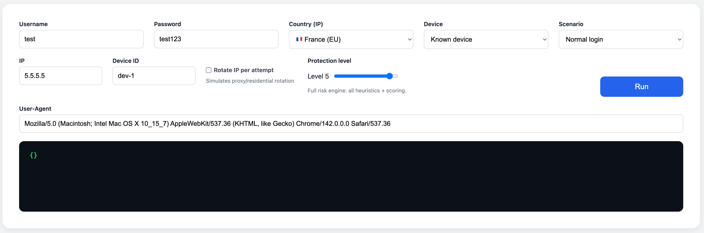

# **ATO Login Simulator**

*A visual, interactive simulator that demonstrates how account-takeover (ATO) risk engines work under different protection levels.*



---

## **🔍 Overview**

The **ATO Login Simulator** is a fully interactive environment for exploring how modern anti-abuse and fraud-detection systems evaluate login attempts.

It visually demonstrates:

* How **risk scoring** changes based on IP, device, geo, and behavior
* How **protection levels** influence platform defenses
* How different **attack scenarios** behave (password spray, credential stuffing, impossible travel, bot-like devices)
* How a backend risk engine evaluates each login and emits structured logs

This project is designed to show **understanding of digital abuse ecosystems, attacker behavior, and risk-based authentication** — key skills for teams like:

* Google Account Security
* Meta Integrity & Risk
* Amazon Fraud Prevention
* Stripe / PayPal Fraud & Risk
* F5 / Akamai / Cloudflare anti-bot teams

---

## **✨ Features**

### **✔ Adjustable Protection Levels**

The slider (0–5) lets you toggle:

* Raw login (no checks)
* Password-only checks
* IP reputation checks
* Device & geo heuristics
* Risk scoring engine
* Full-stack risk engine

---

### **✔ Real Attack Scenarios**

Built-in scenarios replicate attackers:

| Scenario                | Description                                      |
| ----------------------- | ------------------------------------------------ |
| **Normal login**        | Standard clean login from a known device.        |
| **Impossible travel**   | Two geographically distant logins seconds apart. |
| **Password spray**      | 5 attempts → rotating IP (optional).             |
| **Credential stuffing** | Common attacker pattern across weak passwords.   |

---

### **✔ Risk Engine (Backend)**

Each login attempt is evaluated using heuristics:

* Password correctness
* New vs known device
* New vs known IP
* Impossible travel detection
* Bot-like user-agent patterns
* IP rotation speed
* Protection-level overrides
* Geo consistency

Output includes:

* `decision` → ALLOW / MFA_REQUIRED / BLOCK
* `score` → numeric risk score
* `reasons` → human-readable explanations
* `success` → password correctness
* `protectionLevel` used

---

### **✔ Event Log Dashboard**

All login attempts appear in a dashboard:

* Timestamp
* Username
* IP
* Device
* Score
* Decision
* Success
* Reasons

Perfect for demonstrating:

* How systems record fraud attempts
* How analysts review login patterns
* How protection levels impact outcomes

---

## **🧩 Architecture**

```
/backend
  ├── src
  │   ├── api
  │   │   ├── login.ts        → risk evaluation
  │   │   └── logins.ts       → event log APIs
  │   ├── risk
  │   │   └── ato.ts          → risk engine logic
  │   ├── storage             → mock database
  │   └── index.ts            → server, static hosting
/public
  ├── login.html              → simulator UI
  └── dashboard.html          → event log dashboard
```

* **Backend:** Node + Express (TypeScript)
* **Frontend:** Vanilla HTML/JS (zero frameworks)
* **Storage:** In-memory mock DB for simulation

---

## **🚀 Getting Started**

### **1. Install dependencies**

```bash
cd backend
npm install
```

### **2. Start the server**

```bash
npm run dev
```

You’ll see:

```
ATO Simulator running on http://localhost:3001
Serving static files from: /public
```

### **3. Open the UI**

Visit:

```
http://localhost:3001/login.html
```

For the dashboard:

```
http://localhost:3001/dashboard.html
```

---

## **🎮 How to Use the Simulator**

1. Enter a username, password, IP, device ID, and user-agent
2. Adjust the **protection level**
3. Select a **scenario** (Normal, Spray, Stuffing, Impossible Travel)
4. Click **Run**
5. Watch:

   * Response JSON update in real-time
   * Dashboard show each login attempt

---

## **🔒 Why This Project Is Valuable**

This simulator shows that you understand:

* Risk-based authentication
* ATO attack patterns
* How fraud detection systems score risk
* Geo-based heuristics
* Device fingerprinting basics
* Bot traffic behavior
* Event logging and login analytics
* Designing explainable fraud systems

---

## **🗺 Roadmap / Possible Extensions**

* Device fingerprinting hashes
* Behavioral telemetry scoring
* Failed attempt cooldown heuristics
* Risk scoring graphs
* Replay-based threat emulator
* More attack presets (SIM swap, session hijack, proxy-as-a-service)

---

## **📄 License**

MIT License — free to modify and use.

---

If you'd like, I can also generate:

✅ project banner
✅ GitHub badges
✅ a more FAANG-optimized description
✅ a version tailored for recruiters

Just tell me.
